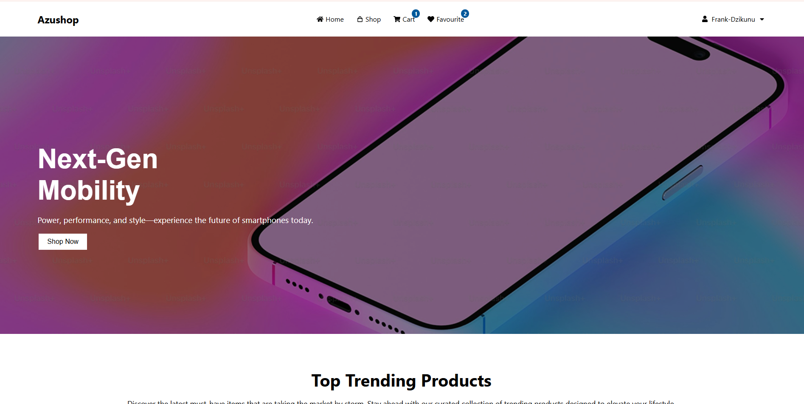
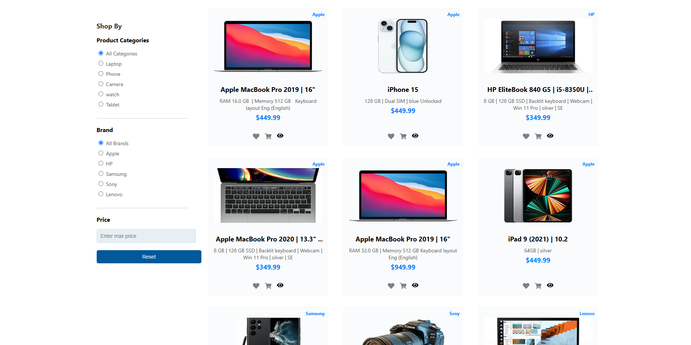
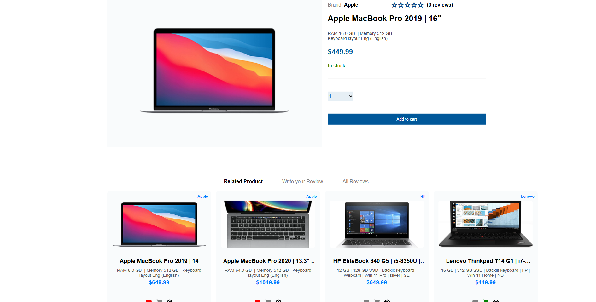
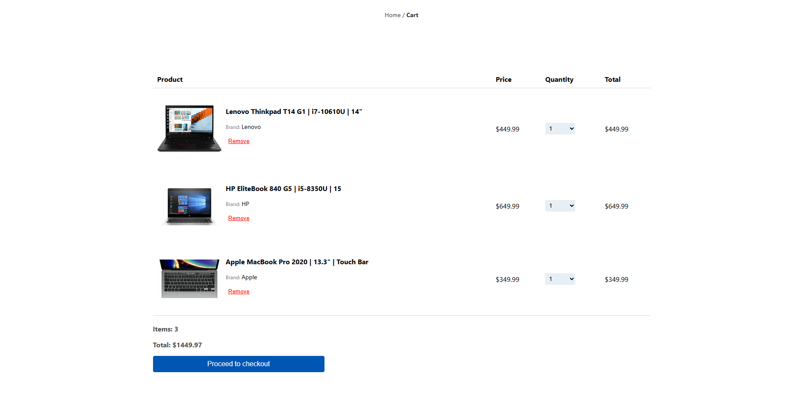
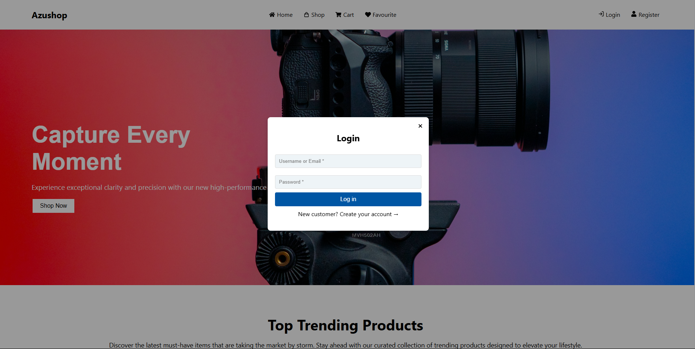
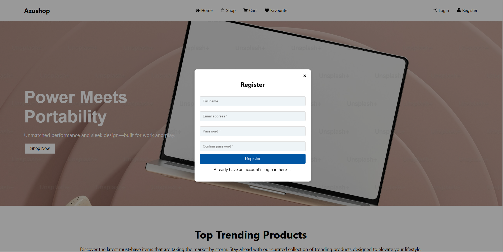
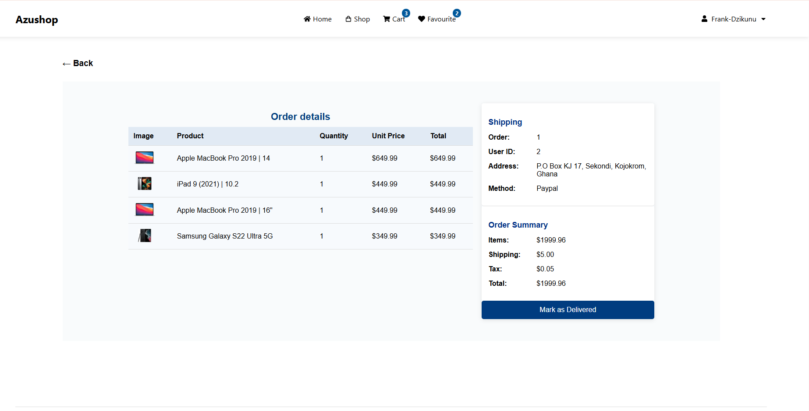

# 🛍️ Azushop – Fullstack E-Commerce Web App

Azushop is a modern fullstack e-commerce platform built using **Django** (backend) and **React** with **Vite** (frontend). It includes full functionality for product listings, reviews, favorites, cart, checkout, and user profile management – all connected to a secure backend and deployed for production use.

---

## 🔗 Live Links

- **Frontend (React - Vercel)**: [https://azushop-swart.vercel.app](https://azushop-swart.vercel.app)
- **Backend (Django - Render)**: [https://azushop-ecommerce.onrender.com](https://azushop-ecommerce.onrender.com)
- **Admin Login**: `/admin`

---

## 📦 Features

### 🧑 Users
- Register and login (JWT auth)
- View and update profile
- Change password
- View past orders

### 🛒 Products
- View all products
- Product detail with tabs:
  - Description
  - Related products
  - User reviews
  - Write review (if purchased)
- Add/remove products to/from favorites
- Add/remove products to/from cart

### 🧾 Reviews
- Submit review if the user purchased the product
- View all reviews on product detail

### 🛍️ Cart
- Add to cart
- Remove from cart
- Update quantities
- Total price displayed

### ⭐ Favorites
- Favorite/unfavorite products
- View all favorite products

### 🛠️ Admin
- View all products
- Update product details
- Delete products
- Manage users
- View orders

---

## 🏗️ Tech Stack

### 🔙 Backend (Django REST Framework)
- Django
- Django REST Framework
- JWT Authentication (`djangorestframework-simplejwt`)
- PostgreSQL or SQLite (default)
- Cloudinary (for image uploads)
- WhiteNoise (for static file serving)
- CORS headers

### 🔜 Frontend (React)
- Vite (React + ESBuild)
- React Router DOM
- Axios (API communication)
- React Toastify (notifications)
- Styled with custom CSS
- Icons from React Icons

---

## 🗂️ Project Structure

### Backend

```
backend/
├── api/
│   ├── views.py
│   ├── urls.py
│   ├── serializers.py
│   └── models.py
│   └── ...
├── backend/
│   ├── settings.py
│   ├── urls.py
│   └── wsgi.py
│   └── ...
├── orders/
│   ├── views.py
│   ├── urls.py
│   ├── serializers.py
|   ├── models.py
│   └── ...
├── products/
│   ├── views.py
│   ├── urls.py
│   ├── serializers.py
|   ├── models.py
│   └── ...
├── media/ (product images via Cloudinary)
├── manage.py

```
### Frontend

```
frontend/
├── src/
│   ├── pages/
│   │   ├── Home.jsx
│   │   ├── ProductDetail.jsx
│   │   ├── Profile.jsx
│   │   └── ...
│   ├── components/
│   │   ├── Navbar.jsx
│   │   ├── Cart.jsx
│   │   ├── Favorites.jsx
│   │   └── AdminProductDetails.jsx
│   │   └── ...
│   ├── api.js
│   └── ... 
├── public/
├── vite.config.js
└── package.json
└── ...
```
## 🚀 Deployment

### Backend (Render)

1. Install dependencies:
   ```bash
   pip install gunicorn whitenoise dj-database-url python-decouple
   ```

1. Install dependencies:
   ```bash
   pip install gunicorn whitenoise dj-database-url python-decouple
   ```
2. Setup `Procfile`:
   ```
   web: gunicorn backend.wsgi
   ```
3. Add environment variables on Render:
   - `SECRET_KEY`
   - `DEBUG=False`
   - `DATABASE_URL`
   - `CLOUDINARY_URL` (optional)
   - `ALLOWED_HOSTS`

4. Push to GitHub and connect to Render:
   - Add build command: `pip install -r requirements.txt`
   - Start command: `gunicorn ecommerce.wsgi`

---

### Frontend (Vercel)

1. Update API URLs to point to Render:
   ```js
   const API_URL = 'https://azushop-ecommerce.onrender.com';
   ```

2. Push frontend to GitHub

3. Import into Vercel:
   - Build command: `npm run build`
   - Output directory: `dist`

---

## 🔐 Authentication

- JWT tokens handled by `djangorestframework-simplejwt`
- Tokens are stored in `localStorage` as:
  ```json
  {
    "access": "access_token_here",
    "refresh": "refresh_token_here"
  }
  ```
- Passed in requests as:
  ```http
  Authorization: Bearer <access_token>
  ```

---

## 🧪 Sample Endpoints

### Auth
- `POST /api/register/`
- `POST /api/login/`

### User
- `GET /api/profile/`
- `PUT /api/profile/update/`

### Products
- `GET /api/products/`
- `GET /api/products/:id/`
- `GET /api/products/:id/related/`
- `POST /api/products/:id/review/`

### Admin
- `PUT /api/products/:id/update/`
- `DELETE /api/products/:id/delete/`
- `DELETE /api/users/:id/delete/`

---


## 🔗 Live Demo

🌍 [Visit Azushop](https://azushop-swart.vercel.app)

---

## 🧰 Tech Stack

### 🔙 Backend
- **Django** & **Django REST Framework**
- **JWT Authentication** via SimpleJWT
- **Cloudinary** for image uploads
- PostgreSQL (or SQLite in dev) from **Neon**
- Render deployment

### 🔜 Frontend
- **React.js** with **Vite**
- **Axios** for API calls
- **React Router** for navigation
- **React Toastify** for alerts
- Vercel deployment

---

## 📸 Screenshots

### 🏠 Home Page


### 📄 Products


### 📄 Product Details


### 🛒 Cart


### 🔐 Auth Pages



### 🧍‍♂️ order detail view


---

## ⚙️ Setup Instructions

### Backend Setup

1. **Clone the repo:**

```bash
git clone https://github.com/FrankDzikunu/Azushop-Ecommerce
cd backend
```

2. **Install dependencies:**

```bash
pip install -r requirements.txt
```

3. **Configure Cloudinary and Database in `.env`**

4. **Run migrations and start server:**

```bash
python manage.py makemigrations
python manage.py migrate
python manage.py runserver
```

### Frontend Setup

1. **Navigate to frontend directory:**

```bash
cd Azushop-Ecommerce
```

2. **Install dependencies:**

```bash
npm install
```

3. **Start dev server:**

```bash
npm run dev
```

---

## 🧑‍💻 Deployment

### 🔄 Backend (Render)

- Connect to GitHub repo
- Add build command: `python manage.py migrate && gunicorn backend.wsgi`
- Set environment variables (e.g., `DEBUG`, `CLOUDINARY`, `DATABASE_URL`, etc.)

### 🌐 Frontend (Vercel)

- Connect frontend to Vercel
- Set `VITE_BACKEND_URL` in Vercel env variables
- Auto deploys on commit

---

## 👤 Author

**Frank Dzikunu**  
💼 GitHub: [github.com/FrankDzikunu](https://github.com/FrankDzikunu)  
📧 Email: frankdzikunu50@gmail.com

---

## 🧑‍💻 Developer Notes

- React frontend uses centralized `api.js` for cleaner Axios calls.
- Toast notifications replace default browser alerts.
- Form inputs are prefilled with backend data using React `useEffect`.
- Favorites and cart states are managed via local or server state.
- Cloudinary integration for product images.

---

## 💡 Future Improvements

- Payment integration (Stripe or Paystack)
- Full order management
- Admin dashboard UI
- Pagination on product listing

---

## 📜 License

This project is open-source under the [MIT License](LICENSE).

---

## 👏 Acknowledgements

Thanks to all open-source libraries used in this project:
- [Django REST Framework](https://www.django-rest-framework.org/)
- [React](https://react.dev/)
- [Vite](https://vitejs.dev/)
- [Render](https://render.com/)
- [Vercel](https://vercel.com/)
- [Cloudinary](https://cloudinary.com/)

---

## 🧠 Built With ❤️ by Frank Dzikunu

---
